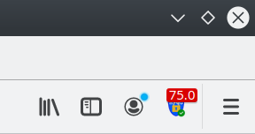
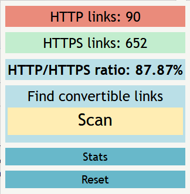
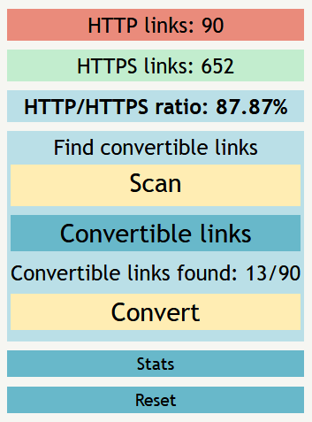
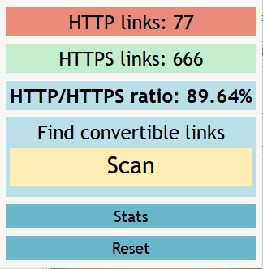

# HTTPS-Upgrader

## Description

Today, there are still too many insecure web links (HTTP). The purpose of this plugin is to make it easier for the user to know how many unsafe links are on the web page he is visiting and to encourage him to visit more secure pages.


## Team

| First Name | Last Name   | Role       | Email                       | LinkedIn                                                   |
|------------|-------------|------------|-----------------------------|-----------------------------------------------------------|
| Simon      | Kramer      | Supervisor | simon\.kramer@bfh\.ch       | [Kramer Simon](https://www.linkedin.com/in/simon-kramer-2700478a/)|
| Patrick    | Grosschmidt | Developer  | p\.grosschmidt@gmail\.com   |  -                                                       |
| Sylvain    | Barthe      | Developer  | sylvain\.barthe@bluewin\.ch | [Barthe Sylvain](https://www.linkedin.com/in/sylvain-barthe-150ab51a2/)|

-------

## Download

- Get it from Firefox addons: *Not yet available* (recomended)

- Get it from GitHub: https://github.com/BartheS23/HTTPS-Upgrader
> GitHub version is recomended only if you want to have the source code.

## Installation

> NOT CONCERNED if downloaded from Firefox Add-ons.

### Import Add-on in Firefox temporarly (Developer)

1.  `Open Mozilla Firefox`

2. Click on the `open menu` (`overflow menu`) and select `Add-ons` (<kbd>Ctrl</kbd> + <kbd>Shift</kbd> + <kbd>A</kbd>)

3. Click on `settings` and `Debug Add-ons`, `Load Temporary Add-on...`

4. Choose the file `content.js` from the project.

### For testing via CLI follow these steps (Developer installation)

1. Unzip the downloaded folder.

2. Install **NodeJS** and **npm**. Run this command as user with sudo privileges.
  ```
  curl -sL https://deb.nodesource.com/setup_10.x | sudo -E bash -
  ```
  Once the NodeSource repository is enabled, install Node.js and npm by typing:
  ```
  sudo apt install nodejs

  ```
  npm installation:

  ```
  sudo curl -L https://npmjs.org/install.sh | sudo sh       
  ```  

  Check the installed version of nodejs and npm:

  ```
  node -v
  npm -v
  ```

  [Install nodejs](https://linuxize.com/post/how-to-install-node-js-on-ubuntu-18.04/)

3. Install **web-ext**
  ```
  npm install --global web-ext
  ```
  Check if it was correctly installed.
  ```
  web-ext --version
  ```

4. Navigate with the terminal to the folder.

  > cd path/of/httpsUpgrader/

5. To launch it in Firefox.
  ```
  web-ext run
  ```

For more information check the following link:

> [installation and execution of web-ext](https://extensionworkshop.com/documentation/develop/getting-started-with-web-ext/)

## How to use it

- Run your Firefox browser and navigate to a website.

> Links will not be found on a JavaScript generated website.

- The badge will show the HTTP/HTTPS ratio of the current webpage your are on.



- To make you aware all HTTP links present on the webpage are highlighted with a yellow color.

- Once the is popup open, it will display the webpage information.



- The **Scan** button allows to find convertible links. Convertibles are HTTP links that have an HTTPS version.

  - It also show the *Convertible links* and *Convert* buttons.



- The **Convertible links** button open a new tab where all the scanned links with their status code are shown.

  - Learn more about the status code here.


- The **Convert** button converts all the HTTP links into HTTPS if it is possible.



- The **Statistics** button open a new tab where some stats information about the browsing session can be found.

  - *Ratio* is the ratio of the total number of HTTP and HTTPS links found on a domain.

  - *Ratio mean* is the mean ratio of the ratios found on a domain.
